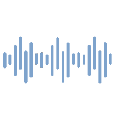

<!-- PROJECT LOGO -->
 

  

  <h2 align="center"> LetsLearnDSP </h2>

  

    A simple DSP library because why not?
  

<!-- TABLE OF CONTENTS -->

  
Table of Contents

  <ol>
    <li>
      <a href="#about-the-project">About The Project</a>
      <ul>
        <li><a href="#built-with">Built With</a></li>
      </ul>
    </li>
    <li>
      <a href="#getting-started">Getting Started</a>
      <ul>
        <li><a href="#prerequisites">Prerequisites</a></li>
        <li><a href="#installation">Installation</a></li>
      </ul>
    </li>
    <li><a href="#roadmap">Roadmap</a></li>
    <li><a href="#contributing">Contributing</a></li>
    <li><a href="#license">License</a></li>
    <li><a href="#contact">Contact</a></li>
  </ol>

<!-- ABOUT THE PROJECT -->
## About The Project

A simple DSP library written in C++ with the aim of learning everything audio development related.

### Built With

Nothing... **Yet!**

<!-- GETTING STARTED -->
## Getting Started

To get a local copy up and running follow these simple example steps.

### Prerequisites

Not a clue yet

### Installation

1. Clone the repo
2. Include the header
3. Hope it works

<!-- ROADMAP -->
## Roadmap

See the [open issues](https://github.com/HamishDelap/LetsLearnDSP) for a list of proposed features (and known issues).

<!-- CONTRIBUTING -->
## Contributing

Contributions are what make the open source community such an amazing place to be learn, inspire, and create. Any contributions you make are **greatly appreciated**.

1. Fork the Project
2. Create your Feature Branch (`git checkout -b feature/AmazingFeature`)
3. Commit your Changes (`git commit -m 'Add some AmazingFeature'`)
4. Push to the Branch (`git push origin feature/AmazingFeature`)
5. Open a Pull Request

<!-- LICENSE -->
## License

Distributed under the MIT License. See `LICENSE` for more information.

<!-- CONTACT -->
## Contact

Hamish Delap - hamish.delap@gmail.com

Project Link: [https://github.com/HamishDelap/LetsLearnDSP](https://github.com/HamishDelap/LetsLearnDSP)

